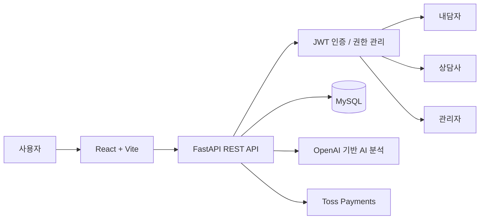

# Counsel-app

> 내담자와 상담사를 연결하고, 상담사 탐색부터 예약·결제·상담 관리·AI 감정일기까지 제공하는 심리상담 플랫폼입니다.

Counsel-app은 **내담자(Client), 상담사(Counselor), 관리자(Admin)** 역할에 따라 서로 다른 기능과 화면을 제공하는 상담 서비스입니다.

프론트엔드는 React + Vite, 백엔드는 FastAPI + SQLAlchemy 기반으로 구성했으며,
상담 예약 및 결제, 상담사 일정 관리, 상담 기록, 관리자 승인, AI 감정일기 등의 기능을 구현했습니다.

## 배포 및 데모

* **서비스 데모:** https://counsel-app-seven.vercel.app/

### 데모 확인 방법

로그인 화면의 **데모 계정** 버튼을 이용하면 별도의 회원가입 없이 서비스 기능을 확인할 수 있습니다.

데모에서는 역할에 따라 다음 계정으로 로그인할 수 있습니다.

* **내담자(Client)** — 상담사 탐색, 예약 및 결제, 찜, AI 감정일기 등
* **상담사(Counselor)** — 상담 일정 및 내담자 관리, 상담 기록, 문의 관리 등
* **관리자(Admin)** — 상담사 승인·반려 및 회원 관리

각 역할로 로그인하면 **권한에 따라 제공되는 서로 다른 화면과 기능을 직접 확인할 수 있습니다.**

## 핵심 기능

### 내담자

* 회원가입 및 로그인
* 상담사 목록 조회 및 상세 정보 확인
* 상담사 검색 및 필터링
* 관심 상담사 찜 추가 / 해제
* 상담 가능 일정 확인
* 상담 예약 및 Toss Payments 결제
* 예약 현황 및 상담 내역 확인
* 상담사 문의
* 알림 조회 및 읽음 처리
* AI 감정일기 작성 및 분석 결과 확인

### 상담사

* 상담사 프로필 등록 및 수정
* 전문 분야, 학력, 경력, 자격증 관리
* 상담 가능 일정 관리
* 휴무일 및 예약 불가 시간 설정
* 예약 요청 확인 및 처리
* 담당 내담자 관리
* 상담 기록 작성 및 조회
* 문의 확인 및 답변
* 상담 완료 처리

### 관리자

* 상담사 가입 승인 / 반려
* 승인 대기 상담사 조회
* 전체 회원 조회
* 회원 역할 및 상태 확인

### AI 감정일기

* 사용자가 작성한 감정 및 일기 데이터 분석
* OpenAI 기반 AI 분석
* 분석 결과 저장
* 최근 AI 감정일기 결과 조회

## 기술 스택

### Frontend

* React
* Vite
* JavaScript
* React Router
* Axios
* lucide-react

### Backend

* FastAPI
* Python
* SQLAlchemy
* Pydantic
* Uvicorn

### Database

* MySQL
* SQLite (일부 개발 환경)

### Authentication

* JWT Access Token
* Role-based Access Control
* localStorage 기반 로그인 상태 관리

### AI

* OpenAI 기반 AI 분석

### Payment

* Toss Payments API
* Toss Payments SDK

### Deployment

* Vercel
* Docker

## 시스템 구성



## 주요 서비스 흐름

### 내담자

```text
로그인
 → 상담사 탐색
 → 상담사 상세 확인
 → 일정 선택
 → 상담 예약
 → 결제
 → 예약 확인
 → 상담 진행 및 기록 확인
```

### 상담사

```text
로그인
 → 상담사 프로필 관리
 → 상담 가능 일정 등록
 → 예약 확인
 → 내담자 관리
 → 상담 기록 작성
 → 상담 완료
```

### 관리자

```text
로그인
 → 관리자 페이지
 → 상담사 승인 대기 목록 확인
 → 상담사 승인 / 반려
 → 전체 회원 관리
```

## 프로젝트 구조

```text
Counsel-app/
├─ frontend/
│  ├─ src/
│  │  ├─ api/              # API 요청
│  │  ├─ components/       # 공통 컴포넌트
│  │  ├─ pages/            # 페이지 컴포넌트
│  │  ├─ static/           # CSS 및 정적 리소스
│  │  ├─ utils/            # 유틸리티
│  │  ├─ App.jsx           # 라우팅 및 앱 구성
│  │  └─ main.jsx
│  └─ package.json
│
├─ backend/
│  ├─ app/
│  │  ├─ api/              # API Router
│  │  ├─ core/             # 공통 설정
│  │  ├─ crud/             # 데이터 처리
│  │  ├─ db/               # DB 설정
│  │  ├─ models/           # SQLAlchemy Model
│  │  ├─ schemas/          # Pydantic Schema
│  │  ├─ services/         # 서비스 로직
│  │  ├─ static/           # 업로드 파일
│  │  ├─ utils/            # AI 등 유틸리티
│  │  └─ main.py
│  └─ requirements.txt
│
├─ Dockerfile
├─ PROJECT_FEATURES.md
├─ PROJECT_GUIDIDE.txt
└─ README.md
```

## 로컬 실행 방법

### 1. Backend

```bash
cd backend

python -m venv .venv

# macOS / Linux
source .venv/bin/activate

# Windows
# .venv\Scripts\activate

pip install -r requirements.txt

uvicorn app.main:app --reload
```

기본 실행 주소:

```text
http://localhost:8000
```

FastAPI API 문서:

```text
http://localhost:8000/docs
```

### 2. Frontend

새 터미널에서 실행합니다.

```bash
cd frontend
npm install
npm run dev
```

프론트엔드 개발 서버에서 `/api`, `/static` 요청은 백엔드 API로 전달됩니다.

## 주요 화면

### 공통

* `/` — 홈
* `/login` — 로그인
* `/signup` — 회원가입
* `/notifications` — 알림

### 내담자

* `/mypage` — 마이페이지
* `/counselors` — 상담사 목록
* `/counselor/:id` — 상담사 상세
* `/reserve` — 상담 예약
* `/reservation` — 예약 내역
* `/payment` — 결제
* `/ai-diary` — AI 감정일기

### 상담사

* `/CounselorHome` — 상담사 홈
* `/CounselorMyPage` — 상담사 마이페이지
* `/CounselorPlanner` — 상담 일정 관리
* `/CounselorClient` — 내담자 관리
* `/CounselorMessages` — 문의 및 메시지 관리

### 관리자

* `/admin/counselors` — 상담사 승인 관리

## 주요 API

### 인증 / 사용자

```http
POST /api/signup
POST /api/login
GET  /api/me
POST /api/user/update
POST /api/user/change-password
```

### 상담사

```http
GET  /api/counselors/approved
GET  /api/counselors/{user_id}
POST /api/counselor/profile
PUT  /api/counselor/profile
```

### 예약 / 결제

```http
POST   /api/booking/create
POST   /api/booking/confirm
GET    /api/booking/list
DELETE /api/booking/cancel/{order_id}

POST   /api/payment/confirm
```

### 상담 일정

```http
POST   /api/schedule
GET    /api/schedule/calendar
POST   /api/blocked-slot
DELETE /api/blocked-slot/{block_id}
```

### AI 감정일기

```http
POST /api/ai-diary/analyze
GET  /api/ai-diary/recent
```

### 관리자

```http
GET   /api/admin/counselors/pending
PATCH /api/admin/counselors/{user_id}/approve
PATCH /api/admin/counselors/{user_id}/reject
GET   /api/admin/users
```

보다 자세한 기능 및 API 명세는 [`PROJECT_FEATURES.md`](./PROJECT_FEATURES.md)에서 확인할 수 있습니다.

## 빌드 및 점검

### Frontend

```bash
cd frontend

npm run lint
npm run build
npm run preview
```

## 실행 시 주의 사항

* API Key, DB 접속 정보, JWT Secret 등의 환경 변수는 GitHub에 커밋하지 않습니다.
* OpenAI API 인증 정보가 없으면 AI 감정일기 분석 기능이 제한될 수 있습니다.
* Toss Payments 인증 정보가 없으면 실제 결제 승인 기능이 제한될 수 있습니다.
* 관리자 페이지는 `admin` 권한을 가진 사용자만 접근할 수 있습니다.
* 상담 기록 등 개인정보와 관련된 데이터는 사용자 역할에 따라 접근 권한을 제한합니다.
